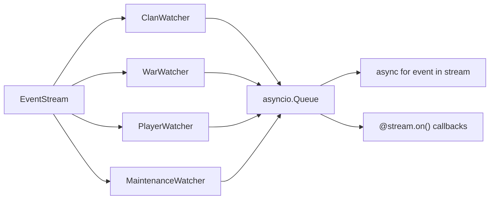

# Event Polling

Monitor clans, wars, and players in real time with poll-and-compare. Async only.

## Basic Setup

```python
import asyncio
from cocapi import CocApi, ApiConfig
from cocapi.events import EventStream, EventType

async def main():
    config = ApiConfig(enable_caching=False)

    async with CocApi("token", config=config) as api:
        stream = EventStream(api)
        stream.watch_clans(["#2PP"], interval=60)
        stream.watch_wars(["#2PP"], interval=30)
        stream.watch_players(["#900PUCPV"], interval=120)

        async with stream:
            async for event in stream:
                print(event.event_type, event.tag)
                for change in event.changes:
                    print(f"  {change.field}: {change.old_value} -> {change.new_value}")

asyncio.run(main())
```

!!! tip
    Disable caching (`enable_caching=False`) so polls always hit the live API.

## Event Types

| Event | Trigger |
|---|---|
| `CLAN_UPDATED` | Any clan field changed (level, points, description, etc.) |
| `MEMBER_JOINED` | New member detected in clan |
| `MEMBER_LEFT` | Member no longer in clan |
| `MEMBER_UPDATED` | Existing member's data changed (trophies, donations, etc.) |
| `MEMBER_ROLE_CHANGED` | Member promoted or demoted |
| `MEMBER_DONATIONS` | Member donation count changed |
| `WAR_STATE_CHANGED` | War state transition (notInWar -> preparation -> inWar -> warEnded) |
| `WAR_ATTACK_NEW` | New attack detected in an active or ended war |
| `PLAYER_UPDATED` | Any tracked player field changed |
| `TROOP_UPGRADED` | Individual troop level increased |
| `SPELL_UPGRADED` | Individual spell level increased |
| `HERO_UPGRADED` | Individual hero level increased |
| `HERO_EQUIPMENT_UPGRADED` | Hero equipment level increased |
| `TOWNHALL_UPGRADED` | Town Hall level increased |
| `BUILDERHALL_UPGRADED` | Builder Hall level increased |
| `PLAYER_NAME_CHANGED` | Player name changed |
| `PLAYER_LEAGUE_CHANGED` | Player league changed |
| `PLAYER_LABEL_CHANGED` | Player labels added or removed |
| `MAINTENANCE_START` | API entered maintenance mode (HTTP 503) |
| `MAINTENANCE_END` | API recovered from maintenance |
| `POLL_ERROR` | API error during polling (watcher continues) |

## Callbacks

Use decorators instead of (or alongside) the async generator:

```python
stream = EventStream(api)
stream.watch_clans(["#2PP"])

@stream.on(EventType.MEMBER_JOINED)
async def on_join(event):
    print(f"{event.metadata['member_name']} joined {event.tag}!")

@stream.on(EventType.WAR_STATE_CHANGED)
async def on_war(event):
    print(f"War: {event.metadata['war_state_from']} -> {event.metadata['war_state_to']}")

await stream.run()  # Blocks, dispatches to callbacks
```

## Watchers

### Clan Watcher

```python
stream.watch_clans(
    ["#TAG1", "#TAG2"],
    interval=60,            # Poll every 60 seconds
    track_members=True,     # Detect join/leave/update (default: True)
)
```

### War Watcher

```python
stream.watch_wars(["#TAG1"], interval=30)
```

Uses a state machine to track war transitions:
`notInWar -> preparation -> inWar -> warEnded -> notInWar`

### Player Watcher

```python
stream.watch_players(
    ["#TAG1"],
    interval=120,
    include_fields=frozenset({"trophies", "townHallLevel"}),  # Only these
    # exclude_fields=frozenset({"achievements"}),             # Or exclude these
)
```

### Maintenance Watcher

```python
stream.watch_maintenance(interval=30)
```

Detects API 503 maintenance windows and emits `MAINTENANCE_START` / `MAINTENANCE_END` events.

## Options

### Backpressure

Control queue size to prevent unbounded memory growth:

```python
stream = EventStream(api, queue_size=1000)
```

### State Persistence

Save snapshots on stop and restore on start to avoid duplicate events after restart:

```python
stream = EventStream(api, persist_path="state.json")
```

## Architecture



Each watcher runs as an independent `asyncio.Task`, polling the API at its configured interval. Changes are detected by comparing the current response to the previous snapshot. Events are pushed to a bounded `asyncio.Queue` for consumption.
